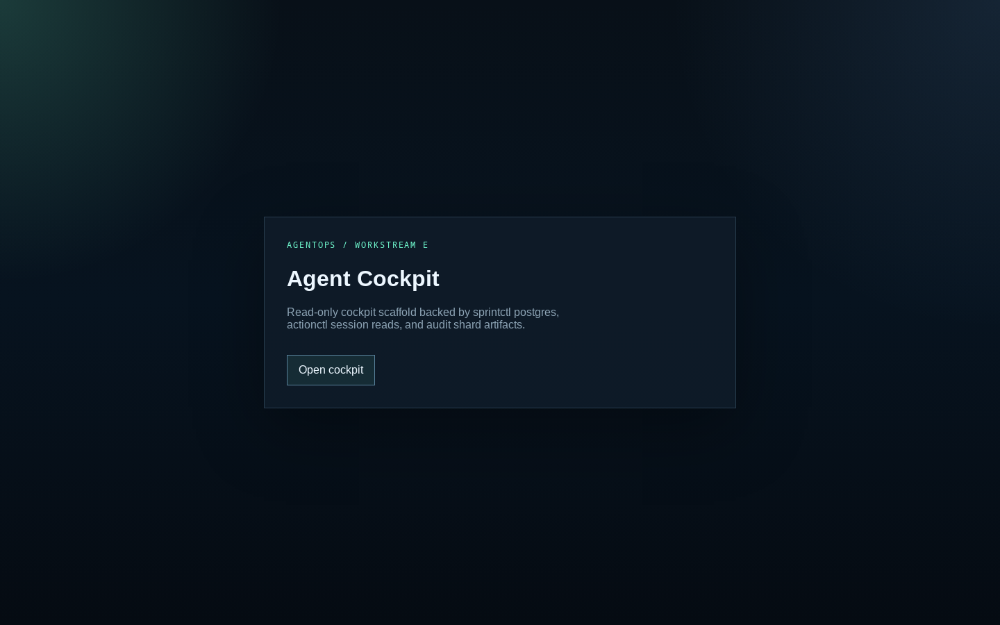
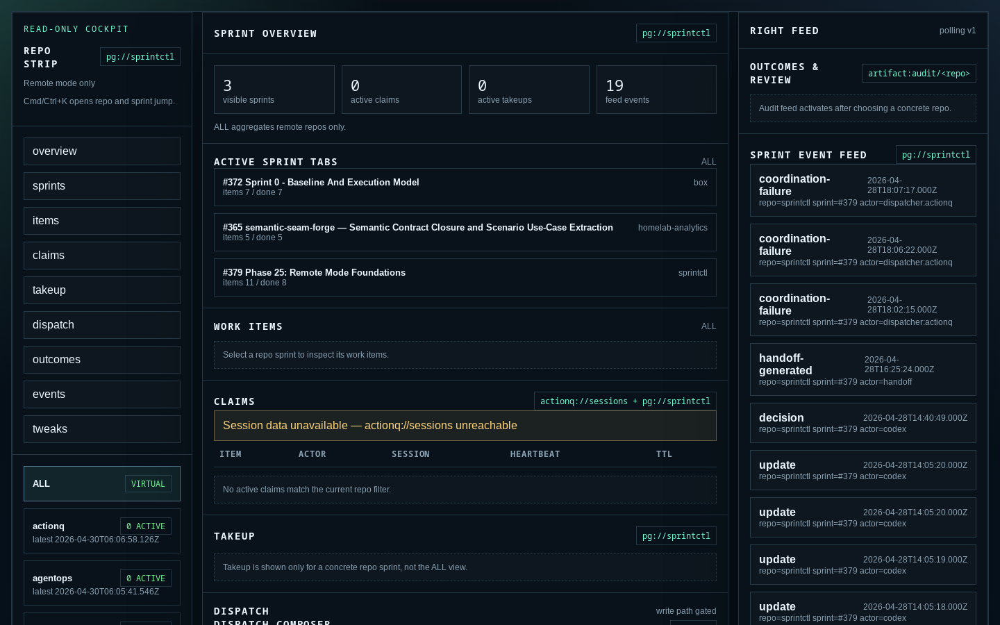
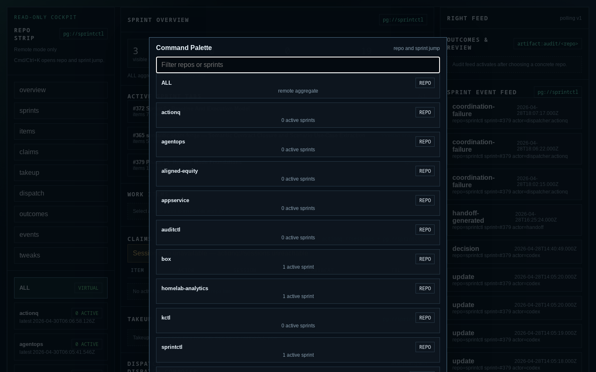

# agentops

[](https://github.com/bayleafwalker/agentops/actions/workflows/pages.yml)

[Explore the interactive AgentOps ecosystem map.](https://bayleafwalker.github.io/agentops/)

[Read the Vuoro system shape and end-to-end walkthrough.](docs/architecture/vuoro-system-shape.md)

Repo-owned planning and future operator surface for the `/projects/dev` agent-ops substrate.

The implementation repos remain separate:

- `sprintctl` owns sprint/work-item state. ([bayleafwalker/sprintctl](https://github.com/bayleafwalker/sprintctl))
- `kctl` owns knowledge artifact extraction. ([bayleafwalker/kctl](https://github.com/bayleafwalker/kctl))
- `auditctl` will own repo-local audit ledgers. ([bayleafwalker/auditctl](https://github.com/bayleafwalker/auditctl))
- `actionq` owns queue and session lifecycle. ([bayleafwalker/actionq](https://github.com/bayleafwalker/actionq))
- `actionq-dispatch` owns bounded worker coordination, worktrees, ACLs, and gates. ([bayleafwalker/actionq-dispatch](https://github.com/bayleafwalker/actionq-dispatch))
- `appservice` owns Kubernetes/GitOps deployment. (private — internal operations only)

This repo owns cross-repo substrate plans now and is the intended home for the future agent-cockpit UI:

```text
docs/plans/agentops/   # cross-repo plans
apps/web/              # agent-cockpit frontend (live)
site/index.html         # interactive map of the wider AgentOps ecosystem
```

## Agent Cockpit

A read-only sprint and session cockpit deployed at `cockpit.kotona.app`. Backed by sprintctl postgres, actionctl session reads, and audit shard artifacts.

### Screenshots

**Home**



**Sprint Overview** — live homelab-analytics backlog, active tasks, claims, and dispatch feed



**Command Palette** — repo and sprint switcher (Ctrl+K)


