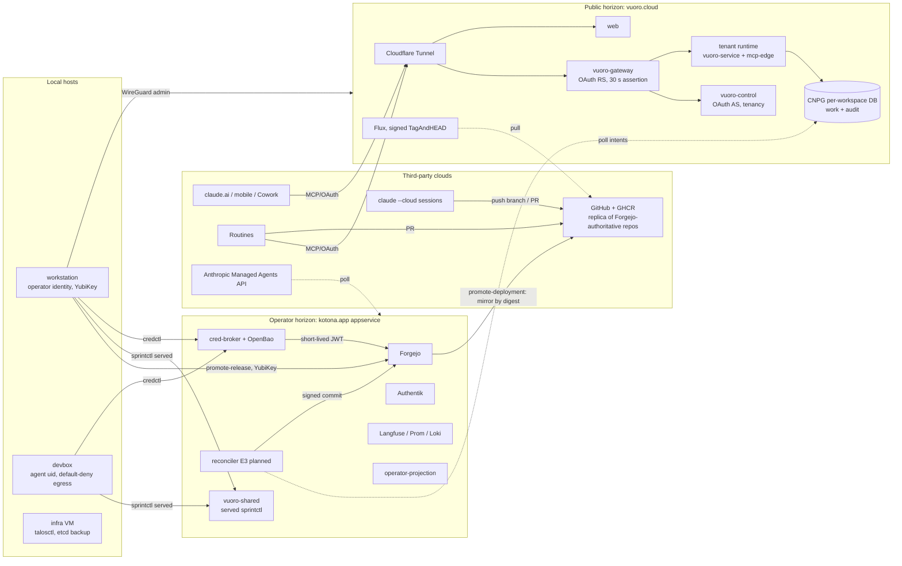

# The agentic ecosystem and the split-horizon direction for vuoro.cloud

Status: proposal (architecture documentation pass, 2026-09-27). Read-only
evidence pass; nothing here changes an accepted decision. Where a statement is
inferred rather than read from a file it is marked **[INF]**. Citations are
`repo:path[:line]` with repos under `/projects/dev`.

Companion passes (same day): backlog ideation (agentops PR #253,
`docs/plans/2026-09-27-backlog-ideation.md`), and a separate telemetry/audit
planning pass that this document references but does not duplicate (§5).

Governing records this document sits under, in order:

1. `agentops:docs/plans/2026-09-17-target-state.md` (TS-1..TS-16).
2. `agentops:docs/plans/2026-09-26-cloud-enablement-plan.md` (adopted 2026-09-26).
3. `vuoro:docs/architecture/agentic-estate.md` (estate of record, 2026-09-12) and
   `agentops:docs/architecture/vuoro-system-shape.md` (ownership boundaries).
4. `vuoro-cloud:docs/02-SYSTEM-ARCHITECTURE.md`, `03-TENANCY-IDENTITY-AND-AUTHORIZATION.md`,
   `docs/CI-AND-INTEGRATION.md`.

## 0. Operator direction being documented

The operator's direction, condensed: **vuoro.cloud becomes the primary
endpoint through which the operator interacts with the whole agentic
workflow.** Supplemental endpoints (`vuoro-shared` on the homelab today; a
`vuoro-self-hosted` deployment in general) coordinate with **horizon-protected
services**: secured, high-sensitivity interactive processes and internal secret
services such as cred-broker. This document names that shape "split horizon",
maps the ecosystem it has to sit on, compares it with fully self-hosted and
fully hosted alternatives, and lists the open questions.

The direction is consistent with TS-16 as written: "intent, coordination and
evidence may cross to a runtime the operator does not host; effects and
credentials may not" (`agentops:docs/plans/2026-09-17-target-state.md:45`).
Split horizon is TS-16 applied to the operator's *own* interaction, not only to
hosted runtimes.

## 1. Ecosystem map

### 1.1 Horizons and hosts

| Horizon | Hosts / clusters | Exposure | Owner repo | Trust level |
|---|---|---|---|---|
| **Public edge** | `vuoro-cloud-poc` (one Hetzner VPS, k3s; Talos green/blue target `clusters/vuoro-cloud-talos`) | `vuoro.cloud`, `api.vuoro.cloud` through Cloudflare Tunnel only; node inbound is UDP 51820 (WireGuard) only (`vuoro-cloud:platform/cloudflared/deployment.yaml:33-37`, `terraform/modules/hetzner-k3s-node/main.tf`) | vuoro-cloud (Forgejo-authoritative, GitHub replica) | Internet-facing; holds work+audit tenant data, OAuth grants, token hashes; holds **no** forge, cluster, S3 or signing credentials (`vuoro-cloud:docs/03-...` credential table) |
| **Operator / homelab** | `appservice` Talos cluster (Cilium Gateway API), TrueNAS (hypervisor, NFS tombstoned), OPNsense (perimeter, egress allowlist) | `*.apps.kotona.app` LAN-only; only `auth.kotona.app` and `cv.kotona.app` are public via cloudflared (`appservice:docs/cloudflare-tunnel.md:1-17`) | appservice (private), gitops-nixos | Trusted. Holds Forgejo, cred-broker, OpenBao, vuoro-shared, Authentik, Langfuse |
| **Local hosts** | `workstation` (NixOS, canonical `/projects/dev`, YubiKey, full operator credentials); `devbox` VM (NixOS, `agent` uid credential-poor, default-deny egress); `infra` VM (agent-free, holds talosctl and etcd backup) | SSH key-only, port 22; no tailnet since 2026-09-04 (`gitops-nixos:README.md:187-194`) | gitops-nixos | workstation: highest (operator identity). devbox: contained. infra: high-privilege, no agents (`gitops-nixos:hosts/infra/default.nix:15-19`) |
| **Third-party clouds** | Anthropic (claude.ai, Routines, `claude --cloud` sandboxes, Managed Agents API), GitHub (replica of Forgejo-authoritative repos, authority for `vuoro` and `agentops`), GHCR, Cloudflare, Hetzner, Scaleway mail | n/a | n/a | Untrusted for effects and credentials; trusted only for what the boundary lets cross (TS-16) |

### 1.2 Components

| Component | Horizon | Owner repo | Runs where | Purpose | Operator interaction | Agent interaction |
|---|---|---|---|---|---|---|
| **vuoro-gateway** | public | vuoro-cloud (`src/vuoro_cloud/gateway.py`) | k3s `vuoro-system` | Bearer/OAuth validation, rate limits, workspace→upstream resolution, mints 30 s Ed25519 assertion `X-Vuoro-Identity`; OAuth resource server for `/mcp` (RFC 9728) | browser dashboard; operator API token (`/api/control/v1/operator/service-controls`, mutation freeze) | MCP over OAuth 2.1 (claude.ai connector, Routines); PAT via vuoro-client (blocked by the missing-Authorization-header bug, `vuoro-cloud:IMPLEMENTATION-STATUS.md`) |
| **vuoro-control** | public | vuoro-cloud (`control.py`, `oauth_server.py`) | k3s `vuoro-system` | Users, invitations, workspaces, memberships, repo bindings, token hashes, connectors, outbox; OAuth 2.1 authorization server (pre-registered clients only, no DCR) | GitHub OAuth (invite-gated, PKCE) browser session | none directly |
| **tenant-controller** | public | vuoro-cloud (`controller.py`, `tenant.py`) | k3s | Outbox-driven reconcile: `vuoro-ws-<ulid>` namespace, per-workspace DB and roles, migration Jobs, runtime Deployment | none | none |
| **tenant runtime** (vuoro-service + vuoro-mcp-edge) | public | vuoro (`packages/vuoro-service`, `packages/vuoro-mcp-edge`) | k3s, one per workspace (pilot: `kotona`) | Composes pinned sprintctl (work) and auditctl (audit) adapters; mcp-edge exposes `list_ready_work`, `describe_work` (gen 47 adds `register_run`, `append_evidence`, `write_session_note`) | via gateway | MCP tools; edge holds no credentials (fails to start if a `_DSN` or PAT-like env is present, `vuoro:packages/vuoro-mcp-edge/README.md`) |
| **CNPG `vuoro-postgres`** | public | vuoro-cloud (`platform/cnpg`) | k3s `vuoro-data` | Control DB + one DB per workspace; daily backup to Hetzner Object Storage | restore drill D-044 | none |
| **kube-prometheus-stack, alerts** | public | vuoro-cloud (`clusters/operators`, `platform/observability`) | k3s | Metrics, SMTP alerting | receives alerts | none |
| **Flux (signed promotion)** | public | vuoro-cloud (`clusters/bootstrap/poc/resources.yaml`) | k3s | Pulls GitHub replica, `verify: TagAndHEAD` against `vuoro-cloud-promotion-keys`; applies operators → platform (SOPS age) → apps | promotes via `scripts/promote-release.sh` (YubiKey touch ×2) | none; hosted runtimes cannot promote |
| **WireGuard `wg0`** | public↔local | vuoro-cloud (`terraform/environments/poc/cloud-init.yaml.tftpl`) | VPS | Operator-only admin path (kubectl, trust Secret, break-glass); direction operator→VPS | NetworkManager profile `vuoro-cloud-operator` | none |
| **vuoro-shared** | homelab | vuoro (image) + appservice (`apps/vuoro-shared`) | appservice Talos, `vuoro-shared.apps.kotona.app` | Served sprintctl backend (work + audit schemas) with a static bearer identity registry (SOPS `vuoro-identities`) | sprintctl CLI via Vuoro profile | sprintctl/kctl/auditctl CLIs via `SPRINTCTL_BACKEND=served` + profile; served mode ignores `--actor` |
| **Forgejo** | homelab | appservice (`apps/forgejo`) | `git.apps.kotona.app`, SSH `:2222` | Canonical forge and promotion authority for vuoro-cloud; registration disabled; Authentik login | `fj` OAuth, workstation token; admin token break-glass | brokered short-lived JWT via credctl; `credctl merge` |
| **cred-broker** | homelab | cred-broker (private) / cred-broker-public | appservice, mTLS API `cred-broker-api.apps.kotona.app:8443` | Capability → short-lived provider credential (Forgejo v16 Authorized Integration JWT, GitHub App installation token); receipts; step-up approval (implemented, not enabled) | enrollment ceremony (OpenBao PKI), `credctl approve` (YubiKey) | `credctl explain|exec|git-credential|merge` with 24 h host cert renewed by timer |
| **OpenBao** | homelab | appservice **[INF]** manifests not under `apps/` | ns `openbao` | Transit signing keys for cred-broker (never exported), PKI for host identities | ceremonies | none |
| **Authentik** | homelab (+public OIDC) | appservice | `auth.apps.kotona.app`, `auth.kotona.app` | IdP; Forgejo login source; proposed admin OIDC for vuoro.cloud (PR #253 H2-8) | browser | none |
| **Langfuse, Prometheus, Loki** | homelab | appservice | cluster | Non-authoritative harness telemetry (TS-15); Langfuse 30 d TTL verified (`agentops:docs/dispatch/handoffs/2026-09-23-program-long-goal-handler.v4.md:38`) | browser | OTel emit-only |
| **operator-projection** | homelab | agentops (`apps/operator-projection`) | `ops.apps.kotona.app` | Derived operator view ("DERIVED — not a record"); effectively the cockpit's successor **[INF]** | browser | none |
| **homelab-analytics** | homelab | homelab-analytics | `analytics.apps.kotona.app` | Household operating platform; pilot consumer of the substrate. Not an agent-telemetry dashboard | browser | none |
| **sprintctl** | local CLI | sprintctl | every agent host | Work items, sprints, reservations (advisory), decisions, refs, events; CAS on revision | CLI | CLI: `session resume`, `next-work`, `reservation reserve`, `item note/ref/decide`, `handoff` |
| **kctl** | local CLI | kctl | agent hosts | Knowledge extract → review → publish; served intake through `vuoro-client` `work.read.events` | CLI | CLI |
| **auditctl** | local CLI + central adapter | auditctl | agent hosts; central schema in vuoro-shared/vuoro.cloud | Repo-local ledger: SQLite index + daily NDJSON shards `_artifacts/<repo>/audit/events-*.ndjson`; central observation ingest | `auditctl list/render` | hooks emit `workflow.session`, `dispatch.exit`; `auditctl add` |
| **agentops** | local/repo | agentops | n/a | Contracts, dispatch skills, workflows (`.claude/workflows/vuoro-dispatch-*.js`, flagged do-not-use until migrated off ActionQ), `model-routing.json`, target state, hooks | authoring | skills, workflows |
| **actionq / actionq-dispatcher** | none | actionq-dispatcher | nowhere | 0.2.0 tombstone; daemon and execution plane removed; `actionq-dispatch.service` on devbox awaits verified retirement (`agentops:docs/ecosystem.md:440-447`) | none | none (fails closed) |
| **Harnesses** | local hosts | agentops `model-routing.json` | workstation (as operator), devbox (`agent`) | Claude Code (anthropic), Codex (codex), OpenCode, `agy`; Kimi reserved. Tiers clerical/frontier-*/fast/standard/hard-build | interactive | native execution; TS-2 keeps sandboxing and model choice harness-native |
| **Claude Code cloud sessions** | third-party | n/a | Anthropic sandbox | `claude --cloud "<brief>"`, credit-billed; GitHub sources only; push unprotected branches + open PRs | dispatches, attaches repo sources | none of homelab reachable |
| **Routines** | third-party | n/a | Anthropic | Scheduled/fired hosted sessions; must end in a GitHub PR (`agentops:docs/runbooks/cloud-routine-authoring.md:11-23`); no forge or served credential | authors, fires (H2-7 proposes homelab-side fire) | OAuth to `/mcp` |
| **claude.ai + Vuoro connector** | third-party | vuoro-cloud (`config/oauth-clients.example.json`, client `claude-connector`) | Anthropic | Interactive MCP: read (+record from gen 47); actor = `external_subject` | chat, mobile, Cowork **[INF]** reachable, not evidenced in use | same |
| **Codex** | local (+third-party model) | agentops `model-routing.json` | workstation/devbox | Reviewer/planner (wrote the options memo; adversarial review of the boundary design); JSON-RPC app-server, deny-only hooks, no SendMessage | interactive | native |
| **vuoro-worker** | homelab (planned) | vuoro (`packages/vuoro-worker`, `deploy/poller`) | homelab host | Managed Agents queue poller with loopback-only internal MCP (8 tools); outbound-only | provisions Managed Agents token | n/a |
| **Reconciler (E3)** | homelab (planned) | product-native, not actionq-dispatcher (options memo :229-259) | homelab | Polls `EffectIntent` rows, executes accepted ones, signs commits | accepts via credctl; auto-accept policy opt-in | proposes only |

### 1.3 System diagram

No arrow runs from PUB into HOME. The homelab reaches the public horizon
outbound only (reconciler polling, operator WireGuard admin, Flux pulling from
GitHub). This is the "no inbound path" property in §3.

### 1.4 Interaction matrix

| Actor | Component | Protocol | Auth (role) | Audit trail |
|---|---|---|---|---|
| Operator (browser) | vuoro.cloud dashboard | HTTPS via Cloudflare | GitHub OAuth session, invite-gated, PKCE; workspace owner | control DB rows; gateway request log |
| Operator (workstation) | vuoro.cloud cluster | WireGuard + kubectl | operator peer key; operator API token for service-controls | none beyond k8s audit **[INF]**; mutation freeze state |
| Operator (workstation) | Forgejo promotion | git + `promote-release.sh` | YubiKey OpenPGP (touch, PIN) | signed commit + tag; `vuoro-deployment-promotion/v1` receipt |
| Operator / agent (local) | Forgejo | HTTPS/SSH via credctl | cred-broker mTLS host cert (24 h) → Forgejo Authorized Integration JWT ≤ 1 h | cred-broker decision + issuance receipts (SQLite); Forgejo merge history pinned to head SHA |
| Operator / agent (local) | vuoro-shared (sprintctl served) | `POST /api/invoke/v1` | static bearer from SOPS identity registry (per-host identities such as the workstation profile) | sprintctl event log; `audit` schema |
| Operator / agent (local) | auditctl | filesystem | host user | NDJSON shards + SQLite index; `rebuild --from-ndjson` |
| Local harness hooks | auditctl / session-costs | Stop, SubagentStop hooks | host user | `workflow.session`, `dispatch.exit` |
| Harness | Langfuse/Prom/Loki | OTel emit-only | exporter creds (appservice) | non-authoritative (TS-15) |
| claude.ai connector, Routines | `api.vuoro.cloud/mcp` | MCP over OAuth 2.1 | `claude-connector` client; scopes `work:read` (+ `vuoro:evidence.record` gen 47); actor = external subject | gateway `mcp_exchange` log; from gen 47 `register_run`/`append_evidence` rows |
| Routines | GitHub | Claude GitHub App | app installation | PR carrying verdict, `Vuoro-Run:` trailer (H1-3) |
| `claude --cloud` sessions | GitHub | Claude GitHub App | session repository sources only; push 403 otherwise (memory note) | PR + run log; commits authored locally afterwards need independent review |
| Codex | local repo, Forgejo via credctl | JSON-RPC app-server | same host identity as the launching user | handoff files; no SendMessage bus |
| Reconciler (planned) | vuoro.cloud intents | HTTPS poll (outbound) | homelab identity; accepts via credctl | intent row + receipt + signed commit chain (TS-16 "reconstructable, not attested") |

## 2. Trust horizons today: what crosses each boundary

**Public edge (vuoro.cloud).** Inbound only through Cloudflare Tunnel to web
and gateway; the gateway resolves exactly one tenant runtime from the
authenticated workspace, never from client input. What crosses in: OAuth
tokens, MCP read/record calls, browser sessions. What crosses out: nothing to
the homelab; Flux pulls signed revisions from GitHub; backups go to Hetzner
Object Storage. Effects and credentials do not cross by structure (no
`vuoro:effect.apply` scope; `REJECTED_SCOPES` at import time).

**Operator/homelab horizon (kotona.app).** LAN-only Gateway; two deliberate
public names (Authentik, CV Studio) via cloudflared with pinned egress. What
crosses in: operator SSH, ChatGPT Actions to the two public names. What crosses
out: vuoro-cloud promotion (mirror by digest Forgejo → GHCR/GitHub, `promote-deployment.yaml`),
OTel to Langfuse stays inside. Forgejo is the promotion authority because
GitHub branch protection is unavailable on the replica.

**Local hosts.** Workstation holds the operator identity and every standing
credential (gh keyring, fj OAuth, kubeconfig via appservice `.envrc`, YubiKey,
cred-broker host cert). Devbox runs agents as `agent`: no wheel, no kube/aws/age/tailnet
state, read-only deploy key on gitops-nixos, nft default-deny with /32
allowances for Forgejo, sprintctl-pg and actionq-pg (the last two are
retirement residue **[INF]**), OPNsense domain allowlist, IPv6 off. Infra VM
holds cluster-reaching credentials "precisely because agents cannot execute
here". Git is the only state mover between hosts; the NFS tree is tombstoned.

**Third-party clouds.** Anthropic sandboxes get: the repo sources attached at
dispatch, the Vuoro connector's OAuth grant, and the Claude GitHub App. They do
not get Forgejo, served sprintctl, SOPS keys or any credential (cloud-enablement
plan decisions 2 and 4). GitHub is authoritative for `vuoro` and `agentops` and a
replica for `vuoro-cloud`; cloud workers use `[carry to Forgejo]` branches for
replica repos.

Known drift at these boundaries (to fix, not design around): `ecosystem.md:463`
still says cockpit auth is "cluster-internal or Tailscale"; `ecosystem.md:436-438`
still describes `SPRINTCTL_URL` injection; `vuoro-cloud:README.md` header says
`poc.22` while `IMPLEMENTATION-STATUS.md` says `poc.44`; CI doc and the E1 design
disagree on whether Flux's verification Secret holds an SSH key or the OpenPGP
promoter key; `agentops:AGENTS.md:38` says TS-1..TS-15.

## 3. Proposed split-horizon architecture

### 3.1 Shape

Two horizons, one product surface:

- **Public interaction horizon** (`vuoro.cloud`): the operator's primary
  endpoint for the agentic workflow. Everything interactive that is not
  high-sensitivity lands here: reading and shaping work (sprintctl work
  catalog), run registration and evidence, session notes, proposing effects,
  reviewing derived views. Reachable from every runtime the operator uses
  (claude.ai, mobile, Cowork, Routines, cloud sessions, Codex via a second
  OAuth client per PR #253 H3-4) and from local harnesses via vuoro-client.
- **Protected horizon** (`vuoro-shared` today; generically `vuoro-self-hosted`
  plus the homelab services): the trusted side that holds credentials and
  performs effects. It **coordinates with** the public horizon by polling; it
  never accepts a call from it.

Capabilities that stay horizon-protected, and why:

| Capability | Stays on | Reason |
|---|---|---|
| cred-broker, OpenBao, SOPS keys, `.sops.yaml` | homelab | Credential custody; INV-001..010 (`cred-broker-public:docs/threat-model.md`); plan decision 6 |
| Effect acceptance (`proposed → accepted`) and the reconciler | homelab | Only a separately authenticated trusted-side actor may accept (plan :33-42); apply authority is forbidden on the public surface (TS-16, C1) |
| Promotion signing | workstation YubiKey | No off-card key; Flux verifies `TagAndHEAD`; runners never promote |
| Merges | workstation/devbox via `credctl merge` | Token in-process only; Forgejo branch protection is the real gate (Q2 of the boundary design) |
| Admin identity for the platform operator | protected, via WireGuard and operator API token; later Authentik OIDC (H2-8) | Operator material "lives only on the workstation"; admin must not be reachable through the same OAuth client the connector uses |
| High-sensitivity interactive processes (step-up approvals, break-glass, restore drills, Talos/etcd, `mutations_frozen`) | workstation, infra VM, WireGuard | Requires hardware presence (YubiKey touch), cluster-reaching credentials, or the ability to freeze the public horizon itself |
| Raw transcripts and host-local artifacts | local hosts | Referenced by digest only (harness-evidence-policy) |

Everything else (work catalog reads and writes, run identity, append-only
evidence, notes, intents, derived projections, telemetry summaries) can live on
the public horizon because it is coordination and record, not effect.

### 3.2 How the two horizons coordinate safely

1. **Queued intents, pull-only.** `propose_effect` writes a run-bound
   `EffectIntent` in state `proposed` and returns; nothing executes in the call.
   The homelab reconciler polls; Vuoro "never assigns, schedules, retries,
   supervises or expires an intent" (TS-1). Because the homelab polls, no
   listener and no inbound route exist on the protected side. The public
   horizon's maximum achievable outcome stays "an unmergeable branch and a
   queued intent" (TS-16).
2. **Acceptance from the trusted side only.** The operator accepts through
   credctl; opt-in auto-accept policies are configured on the trusted side and
   evaluated by the consumer, never the edge; every acceptance records the
   acceptor (person or policy id + version). This is also where the identity
   split bites: an accept is an admin/operator act, never a connector-subject act.
3. **Signed receipts, one chain.** cred-broker issues a non-secret decision
   receipt per authorization and per credential issuance; the reconciler's
   commit carries trailers naming the intent and run (`Vuoro-Run:`); Flux
   verifies the promotion signature. The result is a chain from signed commit →
   intent → receipt → run record naming runtime, model and profile revision.
   Per TS-16 this is described as *reconstructable*, never as attestation.
4. **One-use, body-bound proofs instead of bearer forwarding.** The rejected
   boundary design forwarded the caller's OAuth access token alongside a 30 s
   gateway assertion (`trusted-service-boundary-design.md:40,48`); the review's
   finding (referenced by the cloud-enablement plan as "Required before slice 1"
   item 6, and the H2-style finding the operator direction points at **[INF]**:
   the review document itself is not in agentops) requires replacing that with a
   one-use internal proof bound to the request body digest. vuoro PR #134
   (gateway assertion replay protection) is the first step: it measured one
   assertion being verified up to three times per tool call. The split-horizon
   rule generalizes it: **no credential that arrived on the public horizon is
   ever forwarded across a horizon**; anything the protected side needs is a
   fresh, single-use proof it can verify without trusting the edge.
5. **No inbound path from public to protected.** Node firewall on the VPS admits
   UDP 51820 only; nothing in the cluster references homelab endpoints
   (`vuoro-cloud:platform/registry-credentials/secret.yaml` comment aside);
   WireGuard is operator → VPS. The only technical residue is the WireGuard
   peer's AllowedIPs while the tunnel is up **[INF]**; the recommendation in §6
   is to make that explicit.
6. **Availability decoupling.** GitHub/GHCR mirrors exist so "home availability
   is not a restart or recovery dependency" for the public horizon; conversely
   the homelab must keep working when vuoro.cloud is down, which is why
   sprintctl retains a local backend and the reconciler is a poller.

### 3.3 TS-16 compliance

| TS-16 clause | Split horizon |
|---|---|
| Record covers automated activity wherever it runs | Public horizon is the single record for hosted and interactive runs (register_run, evidence); local runs still land in auditctl until S4 (TS-6) |
| Two reachability paths: public MCP surface; Managed Agents self-hosted worker | Unchanged: `/mcp` on vuoro.cloud; vuoro-worker on the homelab, outbound-only |
| Intent, coordination, evidence may cross; effects and credentials may not | The protected-capability table above is exactly the "may not" set |
| Every tool classifies read/coordinate/record/propose; no effect-apply scope | Kept; the acceptance and reconcile tools are not MCP tools and not on the public surface (PR #253 H1-1) |
| Homelab-side reconciler signs, not the cloud session | Kept; extended so the *operator's* interactive session on vuoro.cloud also does not sign |
| Reconstructable, not attested | Kept in wording of receipts and `vuoro provenance` (H3-2) |

TS-1 is also respected: vuoro stores and serves intents and does nothing else;
the reconciler is homelab-side and product-native, not actionq-dispatcher.

## 4. Alternatives and trade-offs

| Criterion | (a) Fully self-hosted | (b) Fully hosted | (c) Split horizon (proposed) | (d) Variant: split horizon + hosted protected tier |
|---|---|---|---|---|
| Shape | Everything on kotona.app; interactive runtimes reach it through cloudflared public routes or a tailnet | vuoro.cloud holds work, evidence, credentials and performs effects (the rejected Decision 7 shape: in-cluster effects service behind an egress proxy) | vuoro.cloud = interaction and record; homelab = credentials and effects; pull-only coordination | As (c) but the protected tier is a second, operator-only vuoro.cloud namespace/cluster instead of the homelab |
| Security | Smallest public surface but the homelab must expose an OAuth endpoint to Anthropic; a breach lands next to Forgejo, cred-broker, OpenBao | Worst: credential custody on an internet-facing single VPS; violates TS-16 and cred-broker INV-001 ("devbox compromise cannot reach forge-admin root" would have no analogue) | Public compromise yields queued intents and a replica branch, nothing more; protected side has no listener | Better availability than (c) but credentials leave operator custody; requires HSM-class key handling on the VPS; reintroduces the rejected design's threat model (T5 compromised edge) |
| Operability | Home availability becomes the availability of the product; every runtime outage = homelab outage; tailnet was decommissioned 2026-09-04 | Simplest to operate; one cluster | Two deployments to keep compatible (`config/compatibility.json` and adapter pins already exist); reconciler is a new component | Three tiers; more Flux/SOPS overlays |
| Cost | No VPS; Cloudflare tunnel already present | One VPS (cx33) | One VPS + homelab (both already exist) | Two public environments |
| Third-party dependency | Cloudflare, Anthropic, GitHub for replica only | Hetzner, Cloudflare, GitHub, GHCR, Anthropic | Same as (b) for the public tier; homelab keeps working offline (local sprintctl, Forgejo) | Higher |
| Evidence / audit quality | Single store, but hosted runtimes' evidence would still be "absent rather than late" unless the homelab is public | Single store, but the acceptor and the signer are the same horizon, so the chain proves less | Best: two independent horizons corroborate each other (public run/intent rows vs homelab receipts and signed commits) | Similar to (c) but corroboration is weaker because both tiers share the VPS provider |
| Product fit | Not a product; only the operator's estate | Full SaaS, but "coordination without custody" (`vuoro-cloud:docs/19-PRODUCT-POSITIONING.md:81`) is exactly what it would break | Matches positioning: vuoro.cloud coordinates; customers keep execution, repos and credentials (BYO S3, outbound workers) | Possible later tier for customers who want a hosted reconciler; not for the operator |

**Recommendation: (c).** It is the only option that satisfies TS-16 and the
cred-broker invariants while giving the operator one primary endpoint. (a) is
the fallback if vuoro.cloud is parked again, and remains available because
sprintctl local mode, vuoro-shared and Forgejo do not depend on the public
horizon. (b) is rejected on the record (plan :29, C1). (d) is worth keeping as a
*customer* tier idea, not as the operator's architecture.

Variant worth noting inside (c): whether `vuoro-shared` should remain a
separately served sprintctl backend once vuoro.cloud is primary, or shrink to
the protected services only (cred-broker, reconciler, Forgejo, signing). See §6 Q3.

## 5. Auditability across the ecosystem

Where each action is recorded today:

| Action | Record | Store | Gap |
|---|---|---|---|
| Work item change | sprintctl event log (idempotent by key) | vuoro-shared `work` schema or local SQLite | Served mode ignores `--actor`; attribution goes in tags |
| Local session start/stop, subagent exit | `workflow.session`, `dispatch.exit` via hooks | `/projects/dev/.claude/session-costs.jsonl`, auditctl shards | Newest agentops shard is 2026-08-29: capture may have stopped or moved **[INF]**; no retention policy (`auditctl prune` proposed) |
| Harness telemetry | OTel spans/metrics/logs | Langfuse (30 d), Prometheus (15 d), Loki (720 h) | Non-authoritative by design; allowlist CI check required before continuous export |
| Credential decisions and issuance | receipts | cred-broker SQLite on PVC | Receipts are non-secret but unsigned; retention unstated |
| Merge | `credctl merge` receipt + Forgejo merge pinned to head SHA | cred-broker + Forgejo | "Courtesy gate"; Forgejo branch protection is the enforcement |
| Promotion | signed commit + tag, promotion receipt, Flux verification | Forgejo, GitHub replica | CI doc vs E1 doc disagree on verification key type |
| Hosted MCP call | gateway `mcp_exchange` log | vuoro.cloud | Correlation only until gen 47 `register_run`; TS-16 tripwire live and unmet (no Routine has recorded evidence) |
| Routine verdict | GitHub PR | GitHub | Transcript unreachable; PR is the crossing |
| Cloud session work | PR + run log | GitHub/Anthropic | Same |
| Tenant drift, admin acts on vuoro.cloud | control DB, k8s | vuoro.cloud | No audit event per drifted tenant yet (H1-7); operator API acts not surfaced |
| Intent acceptance (planned) | intent row + acceptor + receipt | vuoro.cloud + cred-broker | Not built (E3); insert-only tamper-evident storage is prerequisite #10 |

The separate telemetry/audit planning pass owns the metric design
(reconstructability metric, PR #253 H1-4), storage choice for insert-only audit,
and the retention answers. This document only asks that its outputs satisfy the
corroboration property in §4: an action that crosses horizons must be recorded
independently on both sides.

## 6. Open questions for the operator

**Q1. Primary endpoint for local harnesses: vuoro.cloud or vuoro-shared?**
Options: (a) local CLIs keep `vuoro-shared` as their served backend and only
hosted runtimes use vuoro.cloud; (b) local CLIs move to vuoro.cloud via PAT
once the vuoro-client Authorization bug is fixed, vuoro-shared becomes
protected-only; (c) dual-write. Recommendation: (b), staged after E2, because
"one primary endpoint" is the stated direction and (c) creates two records.
Precondition: the Authorization-header fix and a workstation Vuoro profile with
`production_endpoint_denied` semantics reviewed.

**Q2. Admin identity on the public horizon.** Options: (a) Authentik OIDC for
admin sign-in on vuoro.cloud (H2-8), keeping GitHub OAuth for users; (b) admin
never signs in on the public horizon; all admin is WireGuard + operator token;
(c) both, with admin OIDC limited to read and to freezing mutations.
Recommendation: (c). It keeps the reversible acts (freeze, read) reachable from
anywhere and the irreversible ones (accept, promote, rotate) hardware-bound.
Note: the in-flight admin/user identity design and the vuoro-cli design were
not visible as an agentops PR at the time of this pass (only #253 open;
vuoro #134 is the related identity change).

**Q3. What remains on vuoro-shared after Q1(b)?** Options: (a) retire it and run
the served sprintctl adapter only on vuoro.cloud; (b) keep it as the offline
fallback and as the reconciler's local read model. Recommendation: (b), because
(a) makes home operations depend on the public horizon, which §4 lists as the
main weakness of a fully hosted model.

**Q4. Reconciler acceptance UX.** Options: (a) `credctl accept <intent>` from the
workstation only; (b) also from devbox as `agent` via the broker with step-up;
(c) auto-accept policies for the canary effect classes (`forge_comment_pr`).
Recommendation: (a) first, (c) for comment-class effects once #10 (tamper-evident
audit) lands; (b) only with step-up enabled in production, which it is not yet.

**Q5. Close the WireGuard residue.** Options: (a) restrict the VPS peer's
AllowedIPs to the operator's tunnel address and add an nft rule on the
workstation dropping VPS-originated connections; (b) leave as is. Recommendation:
(a); it is cheap and makes "no inbound path" true at the packet level rather than
by absence of workloads.

**Q6. Audit capture health.** The newest local audit shard is 2026-08-29.
Options: (a) verify the hook → auditctl path and restart capture; (b) declare
session-costs.jsonl plus Langfuse sufficient until S4. Recommendation: (a),
because TS-6 keeps auditctl shards authoritative until S4 and the telemetry pass
needs a live producer to measure.

**Q7. Doc drift listed in §2.** Options: (a) one clean-up PR per repo; (b) fold
into the next generation's release notes. Recommendation: (a), small and
mechanical.
