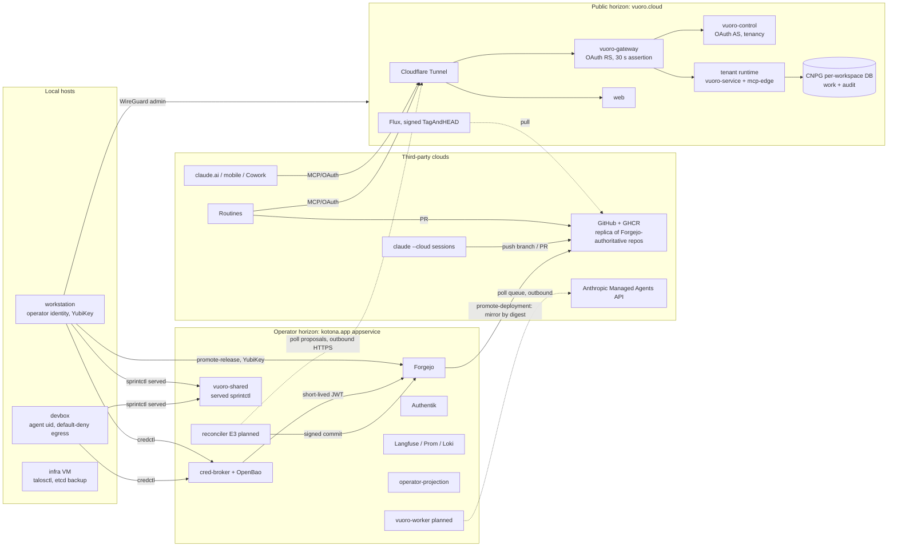
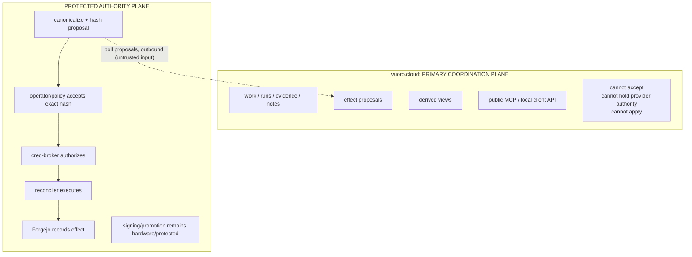

# Coordination without custody: the agentic ecosystem and split-horizon Vuoro

Status: **adopted direction (operator decision, 2026-09-27).** The boundary
model (§3: what is coordination and what is authority, the frozen figure and
its invariant, digest-bound acceptance, the outage state machine) is frozen.
Component choices (which service hosts what, tool sets, auth mechanisms,
storage) are not frozen and may change without amending this document. The
operator's decisions on the former open questions are recorded in §6.
Amended 2026-09-29 (F-3) for decisions C8 and C9 of
`agentops:docs/plans/2026-09-27-admin-identity-and-vuoro-cli-design.md` §8.5:
the `WireGuard wg0` row of the §1.2 component table, a `vuoro-ops` row in the
§1.4 interaction matrix, the restore-drill row of §3.1, the WireGuard sentence
of §3.2 item 6, and Q5 in §6 (with a correction of its AllowedIPs sentence).
Each amended passage is marked; the original text is kept where it still
holds.
Where a statement is inferred rather than read from a file it is marked
**[INF]**. Citations are `repo:path[:line]` with repos under `/projects/dev`.

Names used throughout:

| Level | Name |
|---|---|
| Product principle | **coordination without custody** |
| Authority model | **coordination / authority split** |
| Deployment | **split-horizon Vuoro** |

"Split horizon" is used only as the deployment term; it carries networking/DNS
meaning that the principle does not need.

Companion passes (same day): backlog ideation (agentops PR #253,
`docs/plans/2026-09-27-backlog-ideation.md`), and a separate telemetry/audit
planning pass that this document references but does not duplicate (§5).

Governing records this document sits under, in order:

1. `agentops:docs/plans/2026-09-17-target-state.md` (TS-1..TS-16).
2. `agentops:docs/plans/2026-09-26-cloud-enablement-plan.md` (adopted 2026-09-26).
3. `vuoro:docs/architecture/agentic-estate.md` (estate of record, 2026-09-12) and
   `agentops:docs/architecture/vuoro-system-shape.md` (ownership boundaries).
4. `vuoro-cloud:docs/02-SYSTEM-ARCHITECTURE.md`, `03-TENANCY-IDENTITY-AND-AUTHORIZATION.md`,
   `docs/CI-AND-INTEGRATION.md`.

## 0. Operator direction being documented

The operator's direction, condensed: **vuoro.cloud becomes the primary
endpoint through which the operator interacts with the whole agentic
workflow.** Supplemental endpoints (`vuoro-shared` on the homelab today; a
`vuoro-self-hosted` deployment in general) coordinate with **horizon-protected
services**: secured, high-sensitivity interactive processes and internal secret
services such as cred-broker. This document maps the ecosystem that
split-horizon Vuoro has to sit on, states the boundary model, compares it with
fully self-hosted and fully hosted alternatives, and records the operator's
decisions.

The kernel: **vuoro.cloud is the primary coordination surface; the protected
horizon owns authority.** The meaningful boundary is coordination / record /
proposal versus custody / acceptance / effect, not "cloud versus homelab".

The direction is consistent with TS-16 as written: "intent, coordination and
evidence may cross to a runtime the operator does not host; effects and
credentials may not" (`agentops:docs/plans/2026-09-17-target-state.md:45`).
Coordination without custody is TS-16 applied to the operator's *own*
interaction, not only to hosted runtimes.

## 1. Ecosystem map

### 1.1 Horizons and hosts

| Horizon | Hosts / clusters | Exposure | Owner repo | Trust level |
|---|---|---|---|---|
| **Public edge** | `vuoro-cloud-poc` (one Hetzner VPS, k3s; Talos green/blue target `clusters/vuoro-cloud-talos`) | `vuoro.cloud`, `api.vuoro.cloud` through Cloudflare Tunnel only; node inbound is UDP 51820 (WireGuard) only (`vuoro-cloud:platform/cloudflared/deployment.yaml:33-37`, `terraform/modules/hetzner-k3s-node/main.tf`) | vuoro-cloud (Forgejo-authoritative, GitHub replica) | Internet-facing; holds work+audit tenant data, OAuth grants, token hashes; holds **no** forge, cluster, S3 or signing credentials (`vuoro-cloud:docs/03-...` credential table) |
| **Operator / homelab** | `appservice` Talos cluster (Cilium Gateway API), TrueNAS (hypervisor, NFS tombstoned), OPNsense (perimeter, egress allowlist) | `*.apps.kotona.app` LAN-only; only `auth.kotona.app` and `cv.kotona.app` are public via cloudflared (`appservice:docs/cloudflare-tunnel.md:1-17`) | appservice (private), gitops-nixos | Trusted. Holds Forgejo, cred-broker, OpenBao, vuoro-shared, Authentik, Langfuse |
| **Local hosts** | `workstation` (NixOS, canonical `/projects/dev`, YubiKey, full operator credentials); `devbox` VM (NixOS, `agent` uid credential-poor, default-deny egress); `infra` VM (agent-free, holds talosctl and etcd backup) | SSH key-only, port 22; no tailnet since 2026-09-04 (`gitops-nixos:README.md:187-194`) | gitops-nixos | workstation: highest (operator identity). devbox: contained. infra: high-privilege, no agents (`gitops-nixos:hosts/infra/default.nix:15-19`) |
| **Third-party clouds** | Anthropic (claude.ai, Routines, `claude --cloud` sandboxes, Managed Agents API), GitHub (replica of Forgejo-authoritative repos, authority for `vuoro` and `agentops`), GHCR, Cloudflare, Hetzner, Scaleway mail | n/a | n/a | Untrusted for effects and credentials; trusted only for what the boundary lets cross (TS-16) |

### 1.2 Components

| Component | Horizon | Owner repo | Runs where | Purpose | Operator interaction | Agent interaction |
|---|---|---|---|---|---|---|
| **vuoro-gateway** | public | vuoro-cloud (`src/vuoro_cloud/gateway.py`) | k3s `vuoro-system` | Bearer/OAuth validation, rate limits, workspace→upstream resolution, mints 30 s Ed25519 assertion `X-Vuoro-Identity`; OAuth resource server for `/mcp` (RFC 9728) | browser dashboard; operator API token (`/api/control/v1/operator/service-controls`, mutation freeze) | MCP over OAuth 2.1 (claude.ai connector, Routines); PAT via vuoro-client (blocked by the missing-Authorization-header bug, `vuoro-cloud:IMPLEMENTATION-STATUS.md`) |
| **vuoro-control** | public | vuoro-cloud (`control.py`, `oauth_server.py`) | k3s `vuoro-system` | Users, invitations, workspaces, memberships, repo bindings, token hashes, connectors, outbox; OAuth 2.1 authorization server (pre-registered clients only, no DCR) | GitHub OAuth (invite-gated, PKCE) browser session | none directly |
| **tenant-controller** | public | vuoro-cloud (`controller.py`, `tenant.py`) | k3s | Outbox-driven reconcile: `vuoro-ws-<ulid>` namespace, per-workspace DB and roles, migration Jobs, runtime Deployment | none | none |
| **tenant runtime** (vuoro-service + vuoro-mcp-edge) | public | vuoro (`packages/vuoro-service`, `packages/vuoro-mcp-edge`) | k3s, one per workspace (pilot: `kotona`) | Composes pinned sprintctl (work) and auditctl (audit) adapters; mcp-edge exposes `list_ready_work`, `describe_work` (gen 47 adds `register_run`, `append_evidence`, `write_session_note`) | via gateway | MCP tools; edge holds no credentials (fails to start if a `_DSN` or PAT-like env is present, `vuoro:packages/vuoro-mcp-edge/README.md`) |
| **CNPG `vuoro-postgres`** | public | vuoro-cloud (`platform/cnpg`) | k3s `vuoro-data` | Control DB + one DB per workspace; daily backup to Hetzner Object Storage | restore drill D-044 | none |
| **kube-prometheus-stack, alerts** | public | vuoro-cloud (`clusters/operators`, `platform/observability`) | k3s | Metrics, SMTP alerting | receives alerts | none |
| **Flux (signed promotion)** | public | vuoro-cloud (`clusters/bootstrap/poc/resources.yaml`) | k3s | Pulls GitHub replica, `verify: TagAndHEAD` against `vuoro-cloud-promotion-keys`; applies operators → platform (SOPS age) → apps | promotes via `scripts/promote-release.sh` (YubiKey touch ×2) | none; hosted runtimes cannot promote |
| **WireGuard `wg0`** | public↔local | vuoro-cloud (`terraform/environments/poc/cloud-init.yaml.tftpl`) | VPS | Operator-only admin path (kubectl, trust Secret, break-glass); direction operator→VPS. *Amended 2026-09-29 (F-3; C9):* plus a pull-only appservice peer (`vuoro-ops`, bound to `vuoro-cli-service`); direction protected → VPS for both peers | NetworkManager profile `vuoro-cloud-operator` | none |
| **vuoro-shared** | homelab | vuoro (image) + appservice (`apps/vuoro-shared`) | appservice Talos, `vuoro-shared.apps.kotona.app` | Served sprintctl backend (work + audit schemas) with a static bearer identity registry (SOPS `vuoro-identities`) | sprintctl CLI via Vuoro profile | sprintctl/kctl/auditctl CLIs via `SPRINTCTL_BACKEND=served` + profile; served mode ignores `--actor` |
| **Forgejo** | homelab | appservice (`apps/forgejo`) | `git.apps.kotona.app`, SSH `:2222` | Canonical forge and promotion authority for vuoro-cloud; registration disabled; Authentik login | `fj` OAuth, workstation token; admin token break-glass | brokered short-lived JWT via credctl; `credctl merge` |
| **cred-broker** | homelab | cred-broker (private) / cred-broker-public | appservice, mTLS API `cred-broker-api.apps.kotona.app:8443` | Capability → short-lived provider credential (Forgejo v16 Authorized Integration JWT, GitHub App installation token); receipts; step-up approval (implemented, not enabled) | enrollment ceremony (OpenBao PKI), `credctl approve` (YubiKey) | `credctl explain|exec|git-credential|merge` with 24 h host cert renewed by timer |
| **OpenBao** | homelab | appservice **[INF]** manifests not under `apps/` | ns `openbao` | Transit signing keys for cred-broker (never exported), PKI for host identities | ceremonies | none |
| **Authentik** | homelab (+public OIDC) | appservice | `auth.apps.kotona.app`, `auth.kotona.app` | IdP; Forgejo login source; admin OIDC for vuoro.cloud decided (Q2; design in flight, agentops PR #263) | browser | none |
| **Langfuse, Prometheus, Loki** | homelab | appservice | cluster | Non-authoritative harness telemetry (TS-15); Langfuse 30 d TTL verified (`agentops:docs/dispatch/handoffs/2026-09-23-program-long-goal-handler.v4.md:38`) | browser | OTel emit-only |
| **operator-projection** | homelab | agentops (`apps/operator-projection`) | `ops.apps.kotona.app` | Derived operator view ("DERIVED — not a record"); effectively the cockpit's successor **[INF]** | browser | none |
| **homelab-analytics** | homelab | homelab-analytics | `analytics.apps.kotona.app` | Household operating platform; pilot consumer of the substrate. Not an agent-telemetry dashboard | browser | none |
| **sprintctl** | local CLI | sprintctl | every agent host | Work items, sprints, reservations (advisory), decisions, refs, events; CAS on revision | CLI | CLI: `session resume`, `next-work`, `reservation reserve`, `item note/ref/decide`, `handoff` |
| **kctl** | local CLI | kctl | agent hosts | Knowledge extract → review → publish; served intake through `vuoro-client` `work.read.events` | CLI | CLI |
| **auditctl** | local CLI + central adapter | auditctl | agent hosts; central schema in vuoro-shared/vuoro.cloud | Repo-local ledger: SQLite index + daily NDJSON shards `_artifacts/<repo>/audit/events-*.ndjson`; central observation ingest | `auditctl list/render` | hooks emit `workflow.session`, `dispatch.exit`; `auditctl add` |
| **agentops** | local/repo | agentops | n/a | Contracts, dispatch skills, workflows (`.claude/workflows/vuoro-dispatch-*.js`, flagged do-not-use until migrated off ActionQ), `model-routing.json`, target state, hooks | authoring | skills, workflows |
| **actionq / actionq-dispatcher** | none | actionq-dispatcher | nowhere | 0.2.0 tombstone; daemon and execution plane removed; `actionq-dispatch.service` on devbox awaits verified retirement (`agentops:docs/ecosystem.md:440-447`) | none | none (fails closed) |
| **Harnesses** | local hosts | agentops `model-routing.json` | workstation (as operator), devbox (`agent`) | Claude Code (anthropic), Codex (codex), OpenCode, `agy`; Kimi reserved. Tiers clerical/frontier-*/fast/standard/hard-build | interactive | native execution; TS-2 keeps sandboxing and model choice harness-native |
| **Claude Code cloud sessions** | third-party | n/a | Anthropic sandbox | `claude --cloud "<brief>"`, credit-billed; GitHub sources only; push unprotected branches + open PRs | dispatches, attaches repo sources | none of homelab reachable |
| **Routines** | third-party | n/a | Anthropic | Scheduled/fired hosted sessions; must end in a GitHub PR (`agentops:docs/runbooks/cloud-routine-authoring.md:11-23`); no forge or served credential | authors, fires (H2-7 proposes homelab-side fire) | OAuth to `/mcp` |
| **claude.ai + Vuoro connector** | third-party | vuoro-cloud (`config/oauth-clients.example.json`, client `claude-connector`) | Anthropic | Interactive MCP: read (+record from gen 47); actor = `external_subject` | chat, mobile, Cowork **[INF]** reachable, not evidenced in use | same |
| **Codex** | local (+third-party model) | agentops `model-routing.json` | workstation/devbox | Reviewer/planner (wrote the options memo; adversarial review of the boundary design); JSON-RPC app-server, deny-only hooks, no SendMessage | interactive | native |
| **vuoro-worker** | homelab (planned) | vuoro (`packages/vuoro-worker`, `deploy/poller`) | homelab host | Managed Agents queue poller with loopback-only internal MCP (8 tools); outbound-only | provisions Managed Agents token | n/a |
| **Reconciler (E3)** | homelab (planned) | product-native, not actionq-dispatcher (options memo :229-259) | homelab | Polls proposed `EffectIntent` rows as untrusted input, canonicalizes and hashes them, executes only intents accepted by digest on the protected side, signs commits | `credctl accept` binding the canonical intent digest (§3.2); trusted-side auto-accept policy opt-in, later | proposes only |

### 1.3 System diagram



Connection arrows point from the side that opens the connection; for the two
dashed poll arrows, data (proposals, queued work) flows back against the arrow.
`CB -- short-lived JWT --> FJ` is an issuance relation (the credential is used
by the credctl caller), not a connection. No arrow
runs from PUB into HOME. The protected side reaches the public horizon and the
Managed Agents API outbound only (reconciler and vuoro-worker polling, operator
WireGuard admin from the workstation), and Flux inside PUB pulls from GitHub,
never from HOME. This is the "no service path from the public Vuoro horizon
into the protected horizon" property in §3.2.

### 1.4 Interaction matrix

| Actor | Component | Protocol | Auth (role) | Audit trail |
|---|---|---|---|---|
| Operator (browser) | vuoro.cloud dashboard | HTTPS via Cloudflare | GitHub OAuth session, invite-gated, PKCE; workspace owner | control DB rows; gateway request log |
| Operator (workstation) | vuoro.cloud cluster | WireGuard + kubectl | operator peer key; operator API token for service-controls | none beyond k8s audit **[INF]**; mutation freeze state |
| Operator (workstation) | Forgejo promotion | git + `promote-release.sh` | YubiKey OpenPGP (touch, PIN) | signed commit + tag; `vuoro-deployment-promotion/v1` receipt |
| Operator / agent (local) | Forgejo | HTTPS/SSH via credctl | cred-broker mTLS host cert (24 h) → Forgejo Authorized Integration JWT ≤ 1 h | cred-broker decision + issuance receipts (SQLite); Forgejo merge history pinned to head SHA |
| Operator / agent (local) | vuoro-shared (sprintctl served) | `POST /api/invoke/v1` | static bearer from SOPS identity registry (per-host identities such as the workstation profile) | sprintctl event log; `audit` schema |
| Operator / agent (local) | auditctl | filesystem | host user | NDJSON shards + SQLite index; `rebuild --from-ndjson` |
| Local harness hooks | auditctl / session-costs | Stop, SubagentStop hooks | host user | `workflow.session`, `dispatch.exit` |
| Harness | Langfuse/Prom/Loki | OTel emit-only | exporter creds (appservice) | non-authoritative (TS-15) |
| claude.ai connector, Routines | `api.vuoro.cloud/mcp` | MCP over OAuth 2.1 | `claude-connector` client; scopes `work:read` (+ `vuoro:evidence.record` gen 47); actor = external subject | gateway `mcp_exchange` log; from gen 47 `register_run`/`append_evidence` rows |
| Routines | GitHub | Claude GitHub App | app installation | PR carrying verdict, `Vuoro-Run:` trailer (H1-3) |
| `claude --cloud` sessions | GitHub | Claude GitHub App | session repository sources only; push 403 otherwise (memory note) | PR + run log; commits authored locally afterwards need independent review |
| Codex | local repo, Forgejo via credctl | JSON-RPC app-server | same host identity as the launching user | handoff files; no SendMessage bus |
| `vuoro-ops` (appservice) *(amended 2026-09-29, F-3; C9)* | vuoro.cloud control admin | WireGuard, own `/32`, protected → VPS only | `vuoro-cli-service` JWT-bearer token | chained admin audit |
| Reconciler (planned) | vuoro.cloud intents | HTTPS poll (outbound) | homelab identity; executes only intents the operator (`credctl accept`) or a trusted-side policy accepted by digest | intent row + receipt + signed commit chain (TS-16 "reconstructable, not attested") |

## 2. Trust horizons today: what crosses each boundary

**Public edge (vuoro.cloud).** Inbound only through Cloudflare Tunnel to web
and gateway; the gateway resolves exactly one tenant runtime from the
authenticated workspace, never from client input. What crosses in: OAuth
tokens, MCP read/record calls, browser sessions. What crosses out: nothing to
the homelab; Flux pulls signed revisions from GitHub; backups go to Hetzner
Object Storage. Effects and credentials do not cross by structure (no
`vuoro:effect.apply` scope; `REJECTED_SCOPES` at import time).

**Operator/homelab horizon (kotona.app).** LAN-only Gateway; two deliberate
public names (Authentik, CV Studio) via cloudflared with pinned egress. What
crosses in: operator SSH, ChatGPT Actions to the two public names. What crosses
out: vuoro-cloud promotion (mirror by digest Forgejo → GHCR/GitHub, `promote-deployment.yaml`),
OTel to Langfuse stays inside. Forgejo is the promotion authority because
GitHub branch protection is unavailable on the replica.

**Local hosts.** Workstation holds the operator identity and every standing
credential (gh keyring, fj OAuth, kubeconfig via appservice `.envrc`, YubiKey,
cred-broker host cert). Devbox runs agents as `agent`: no wheel, no kube/aws/age/tailnet
state, read-only deploy key on gitops-nixos, nft default-deny with /32
allowances for Forgejo, sprintctl-pg and actionq-pg (the last two are
retirement residue **[INF]**), OPNsense domain allowlist, IPv6 off. Infra VM
holds cluster-reaching credentials "precisely because agents cannot execute
here". Git is the only state mover between hosts; the NFS tree is tombstoned.

**Third-party clouds.** Anthropic sandboxes get: the repo sources attached at
dispatch, the Vuoro connector's OAuth grant, and the Claude GitHub App. They do
not get Forgejo, served sprintctl, SOPS keys or any credential (cloud-enablement
plan decisions 2 and 4). GitHub is authoritative for `vuoro` and `agentops` and a
replica for `vuoro-cloud`; cloud workers use `[carry to Forgejo]` branches for
replica repos.

Known drift at these boundaries (to fix, not design around): `ecosystem.md:463`
still says cockpit auth is "cluster-internal or Tailscale"; `ecosystem.md:436-438`
still describes `SPRINTCTL_URL` injection; `vuoro-cloud:README.md` header says
`poc.22` while `IMPLEMENTATION-STATUS.md` says `poc.44`; CI doc and the E1 design
disagree on whether Flux's verification Secret holds an SSH key or the OpenPGP
promoter key; `agentops:AGENTS.md:38` says TS-1..TS-15.

## 3. Split-horizon Vuoro: the coordination / authority split

### 3.0 The boundary model (frozen 2026-09-27)

This figure and the invariant under it are the frozen part of the
architecture. The boxes list responsibilities, not components; which service
carries each line is a component choice and is not frozen.



As in §1.3, the poll arrow points from the side that opens the connection
(the reconciler, on the protected side); proposals flow back against it as
data.

**Critical invariant.** *Nothing originating in the coordination plane
becomes an effect merely because the coordination plane says it should.*
This is stronger than "credentials don't cross": it also covers a public
horizon that holds no credentials but tries to steer the protected side.

### 3.1 Shape

Two horizons, one product surface:

- **Public coordination horizon** (`vuoro.cloud`): the operator's primary
  endpoint for the agentic workflow and the **primary coordination ledger**.
  Everything interactive that is not high-sensitivity lands here: reading and
  shaping work (sprintctl work catalog), run registration and evidence,
  session notes, proposing effects, reviewing derived views. Reachable from
  every runtime the operator uses (claude.ai, mobile, Cowork, Routines, cloud
  sessions, Codex via a second OAuth client per PR #253 H3-4) and from local
  harnesses via vuoro-client (Q1). It is not "the single record": the system's
  full provenance is deliberately distributed across public records, protected
  receipts and signed repository history.
- **Protected horizon** (`vuoro-shared` plus the homelab services today;
  generically `vuoro-self-hosted`): the trusted side that holds credentials,
  accepts and performs effects. It **coordinates with** the public horizon by
  polling; it never accepts a call from it. `vuoro-shared` is a **protected
  substrate + emergency coordination island** (Q3), not a peer production
  backend: during normal operation it is not a second sprintctl server that
  the public horizon's records compete with (§3.3).

Capabilities that stay horizon-protected, and why:

| Capability | Stays on | Reason |
|---|---|---|
| cred-broker, OpenBao, SOPS keys, `.sops.yaml` | homelab | Credential custody; INV-001..010 (`cred-broker-public:docs/threat-model.md`); plan decision 6 |
| Effect acceptance (`proposed → accepted`) and the reconciler | homelab | Only a separately authenticated trusted-side actor may accept (plan :33-42); apply authority is forbidden on the public surface (TS-16, C1); acceptance binds the canonical intent digest (§3.2) |
| Promotion signing | workstation YubiKey | No off-card key; Flux verifies `TagAndHEAD`; runners never promote |
| Merges | workstation/devbox via `credctl merge` | Token in-process only; Forgejo branch protection is the real gate (Q2 of the boundary design) |
| Protected-only operator acts: effect acceptance, credential/policy change, promotion, key rotation, recovery operations | workstation, infra VM, WireGuard | Operator material "lives only on the workstation"; never reachable through public sign-in, not even with step-up (Q2) |
| High-sensitivity interactive processes (cred-broker step-up approvals, break-glass, ~~restore drills~~, Talos/etcd) | workstation, infra VM, WireGuard | Requires hardware presence (YubiKey touch) or cluster-reaching credentials |
| Restore drills, automated (amended 2026-09-29, F-3) | appservice cluster (`vuoro-ops` workload identity), WireGuard | Protected-side workload identity; the drill route enforces the C8 invariant server-side, so a drill changes no production state and cannot starve it |
| Raw transcripts and host-local artifacts | local hosts | Referenced by digest only (harness-evidence-policy) |

Public admin sign-in (Q2) is Authentik OIDC with its own client, audience and
scopes, separate from the connector identity. It carries read status, tenant
inspection and audit/health inspection; `mutations_frozen` / unfreeze
additionally requires explicit operator step-up, because freezing is a
powerful availability action even though it is reversible.

**Amended 2026-09-29 (F-3; design memo §8.5 C8).** Restore drills leave the
interactive row above: they are automated and run by the protected-side
`vuoro-ops` workload identity (scope `vuoro:admin.backup`) through a narrow
drill route that is exempt from the operation assertion the design memo (D1)
otherwise requires on every admin mutation. It is the single named exception,
and it holds only
because the route enforces its invariant server-side: the target namespace is
fixed to `vuoro-restore-drill` and any other target is refused; at most one
drill per 24 h; a `ResourceQuota` (storage, memory, CPU) and a default-deny
NetworkPolicy on that namespace; a free-disk headroom check before the drill
starts; the drill Cluster has no `backup` section and restores with read-only
credentials to the primary bucket; the drill is deleted by TTL; each run is
audited. The first drill through the route is run by the operator; after
that the drills are scheduled.

Everything else (work catalog reads and writes, run identity, append-only
evidence, notes, intents, derived projections, telemetry summaries) can live on
the public horizon because it is coordination and record, not effect.

**Threat model for a compromised public horizon.** The public horizon owns
work state, run/evidence records, notes, intents and derived projections. A
compromised public tier cannot execute an effect, but it **can poison the
information on which the operator or protected-side policy makes decisions**:
fabricate or corrupt proposals, work items and evidence. That is a different
threat from credential theft, but still a threat, so the protected side treats
every proposed effect as **untrusted input**, never as an authenticated
instruction. The claim this architecture makes is:

> Compromise of the public horizon can fabricate or corrupt proposals, but
> cannot alter an accepted effect or exercise protected authority.

### 3.2 How the two horizons coordinate: untrusted proposal → digest-bound protected acceptance → effect

1. **Untrusted proposal, pull-only.** A cloud caller never applies an effect;
   it queues one. `propose_effect` writes a run-bound `EffectIntent` in state
   `proposed` and returns; nothing executes in the call. The homelab
   reconciler polls; Vuoro "never assigns, schedules, retries, supervises or
   expires an intent" (TS-1). Because the protected side polls, it runs no
   listener reachable from the public horizon. What the reconciler retrieves
   is an untrusted proposed object: it canonicalizes it and computes its hash
   on the protected side, and trusts nothing the public horizon asserts about
   it. TS-16 bounds a hosted runtime's maximum achievable outcome at "an
   unmergeable branch and a queued intent"; the same effect ceiling holds for
   a compromised public horizon, while its maximum achievable *harm* includes
   poisoned proposals and records (§3.1 threat model), which the acceptance
   step exists to catch.
2. **Digest-bound protected acceptance.** Only a separately authenticated
   trusted-side actor moves an intent from `proposed` to `accepted`; the
   proposing caller never does, and no cloud-reachable tool or MCP surface
   can. The acceptance invariant:

   ```text
   acceptance = protected-side approval(
       canonical_hash(
           intent type
           exact parameters
           source run
           relevant immutable evidence refs
       )
   )
   ```

   The operator accepts with `credctl accept`, which binds this canonical
   intent digest, not merely the intent ID (Q4), and shows the operator the
   protected-side canonical object it hashes, not a vuoro.cloud view of it. Opt-in auto-accept policies
   are off by default, set only from the trusted side, evaluated by the
   consumer asynchronously and never by the edge, and approve the same digest.
   Every acceptance records the acceptor (person, or policy id + version +
   scope). An accept is an operator/policy act, never a connector-subject act.
3. **Effect on exactly what was accepted.** After acceptance the public side
   cannot alter what was accepted: the reconciler executes the protected-side
   copy of the accepted object, and any change to type, parameters, source run
   or immutable evidence refs yields a new hash and therefore a new intent that needs its
   own acceptance. cred-broker authorizes the capability, the reconciler
   executes, and Forgejo records the effect.
4. **Receipts, one reconstructable chain.** cred-broker issues a non-secret
   decision receipt per authorization and per credential issuance (unsigned
   today, §5); the reconciler's commit carries trailers naming the intent and
   run (`Vuoro-Run:`); Flux verifies the promotion signature. The result is a
   chain from signed commit → accepted digest → intent → receipt → run record
   naming runtime, model and profile revision. Per TS-16 this is described as
   *reconstructable*, never as attestation.
5. **Three separate mechanisms, not one proof.** The rejected boundary design
   forwarded the caller's OAuth access token alongside a 30 s gateway
   assertion (`trusted-service-boundary-design.md:40,48`); the review's
   finding (referenced by the cloud-enablement plan as "Required before slice
   1" item 6 **[INF]**: the review document itself is not in agentops)
   requires replacing that with a one-use internal proof bound to the request
   body digest. That proof is scoped to calls *inside* the public horizon and
   is not the cross-horizon security primitive: a proof minted on the public
   horizon would require the protected side to trust an authority on that
   horizon, and a gateway signature does not survive a compromised gateway.
   Effect authorization does not need it, because the protected side creates
   its own acceptance. The three mechanisms are:

   ```text
   Public internal calls
   gateway → tenant runtime
       body-bound / one-use assertion
       useful against replay / confused deputy

   Cross-horizon
   public intent → protected reconciler
       untrusted proposed object

   Protected acceptance
   operator/policy → exact intent digest
       authoritative
   ```

   vuoro PR #134 (gateway assertion replay protection, which measured one
   assertion being verified up to three times per tool call) implements the
   first. The standing rule remains: **no credential that arrived on the
   public horizon is ever forwarded across a horizon.**
6. **No service path from the public Vuoro horizon into the protected
   horizon.** The homelab does deliberately expose some services publicly
   (Authentik, CV Studio via cloudflared) and WireGuard exists, so the claim is
   deliberately this narrow one. Node firewall on the VPS admits UDP 51820
   only; nothing in the cluster references homelab endpoints
   (`vuoro-cloud:platform/registry-credentials/secret.yaml` comment aside);
   WireGuard is operator → VPS. The residue is the WireGuard peer's AllowedIPs
   while the tunnel is up **[INF]**; Q5 decides to close it at the packet
   level rather than rely on the absence of a listening workload.
   *Amended 2026-09-29 (F-3; design memo §8.5 C9):* WireGuard has a second
   protected peer, the appservice cluster (`vuoro-ops`), which is pull-only:
   protected → VPS, never VPS → protected. Q5's packet-level rules apply to it
   as they do to the operator's peer.
7. **Availability decoupling.** GitHub/GHCR mirrors exist so "home
   availability is not a restart or recovery dependency" for the public
   horizon; conversely the homelab must keep working when vuoro.cloud is down,
   which is why sprintctl retains a local backend and the reconciler is a
   poller. Writing while vuoro.cloud is down is governed by §3.3.

### 3.3 Outage semantics: NORMAL / DEGRADED LOCAL / RECOVERY

vuoro.cloud is the primary endpoint *and* homelab operation must continue
when it is unavailable. Once the fallback can write there are two histories
unless recovery is defined. **Active-active dual writing is rejected.** The
state machine:

```text
NORMAL
  vuoro.cloud = coordination authority
  vuoro-shared = protected services + cached/local fallback

DEGRADED LOCAL
  operator deliberately enters local-island mode
  local records receive a distinct outage epoch

RECOVERY
  import/reconcile outage epoch into vuoro.cloud
  conflicts surfaced, never silently merged
  return authority to public horizon
```

Entering DEGRADED LOCAL is an explicit operator act, not an automatic
failover. The state machine is part of the architecture now; its
implementation (epoch tagging, import, conflict surfacing) may come later
(§7).

**Transition (until Q1(b) lands).** Today local sprintctl, kctl and auditctl
writes go to `vuoro-shared` (and auditctl shards), while hosted and
interactive runs write to vuoro.cloud. That is not the NORMAL state above and
not an outage epoch; it is the pre-cutover arrangement. The rule during it:
each record family has exactly one named authoritative store and is never
written to both. Local work changes: `vuoro-shared` (or local SQLite). Local
evidence: auditctl shards (TS-6). Hosted and interactive runs, their evidence
and notes: vuoro.cloud. No hosted MCP tool writes work items
(§1.2: `list_ready_work`, `describe_work`, and from gen 47 run, evidence and
note tools), so `vuoro-shared` is authoritative for work items until the
cutover and any vuoro.cloud work catalog is a read-only copy.
Nothing is dual-written. NORMAL begins at the Q1(b) cutover
(after the Authorization-header fix and E2), when local harnesses move to
vuoro.cloud and `vuoro-shared` drops to protected services + fallback.

### 3.4 TS-16 compliance

TS-16 is unamended (cloud-enablement plan, 2026-09-26, :31-42): cloud callers
only queue effects, and acceptance is trusted-side (interactive, or opt-in
trusted-side auto-accept). `vuoro:effect.propose` stays reserved until a durable
intent store exists **and** every tenant runtime serves the propose tools.
`vuoro:work.claim` met its condition (exclusive, durable lease; claim tools in
every tenant runtime from generation 51) and is granted by vuoro-cloud #149,
live from generation 52 (v0.1.0-poc.52), to `claude-connector` only; minted
and agent tokens still refuse it by name. The edge
refuses assertions carrying authorities with no tools
(`vuoro-cloud:src/vuoro_cloud/oauth_scopes.py:22-36`;
`agentops:docs/design/e1/e1-stronger-baseline-design-2026-09-22.md:241-245,438-441`).

| TS-16 clause | Split-horizon Vuoro |
|---|---|
| Record covers automated activity wherever it runs | Public horizon is the primary coordination ledger for hosted and interactive runs (register_run, evidence); local runs still land in auditctl until S4 (TS-6); full provenance also spans protected receipts and signed repo history |
| Two reachability paths: public MCP surface; Managed Agents self-hosted worker | Unchanged: `/mcp` on vuoro.cloud; vuoro-worker on the homelab, outbound-only |
| Intent, coordination, evidence may cross; effects and credentials may not | The protected-capability table above is exactly the "may not" set; crossing intents are untrusted input |
| Every tool classifies read/coordinate/record/propose; no effect-apply scope | Kept; the acceptance and reconcile tools are not MCP tools and not on the public surface (PR #253 H1-1); propose scope reserved and claim scope connector-only, as above |
| Homelab-side reconciler signs, not the cloud session | Kept; extended so the *operator's* interactive session on vuoro.cloud also does not sign |
| Reconstructable, not attested | Kept in wording of receipts and `vuoro provenance` (H3-2) |

TS-1 is also respected: vuoro stores and serves intents and does nothing else;
the reconciler is homelab-side and product-native, not actionq-dispatcher.

## 4. Alternatives and trade-offs

| Criterion | (a) Fully self-hosted | (b) Fully hosted | (c) Split-horizon Vuoro (adopted) | (d) Variant: split-horizon Vuoro + hosted protected tier |
|---|---|---|---|---|
| Shape | Everything on kotona.app; interactive runtimes reach it through cloudflared public routes or a tailnet | vuoro.cloud holds work, evidence, credentials and performs effects (the rejected Decision 7 shape: in-cluster effects service behind an egress proxy) | vuoro.cloud = primary coordination ledger; homelab = credentials, acceptance and effects; pull-only coordination | As (c) but the protected tier is a second, operator-only vuoro.cloud namespace/cluster instead of the homelab |
| Security | Smallest public surface but the homelab must expose an OAuth endpoint to Anthropic; a breach lands next to Forgejo, cred-broker, OpenBao | Worst: credential custody on an internet-facing single VPS; violates TS-16 and cred-broker INV-001 ("devbox compromise cannot reach forge-admin root" would have no analogue) | Public compromise can fabricate or corrupt proposals and the records decisions rest on, but cannot alter an accepted effect or exercise protected authority (digest-bound acceptance, §3.2); protected side has no listener reachable from the public horizon | Better availability than (c) but credentials leave operator custody; requires HSM-class key handling on the VPS; reintroduces the rejected design's threat model (T5 compromised edge) |
| Operability | Home availability becomes the availability of the product; every runtime outage = homelab outage; tailnet was decommissioned 2026-09-04 | Simplest to operate; one cluster | Two deployments to keep compatible (`config/compatibility.json` and adapter pins already exist); reconciler is a new component | Three tiers; more Flux/SOPS overlays |
| Cost | No VPS; Cloudflare tunnel already present | One VPS (cx33) | One VPS + homelab (both already exist) | Two public environments |
| Third-party dependency | Cloudflare, Anthropic, GitHub for replica only | Hetzner, Cloudflare, GitHub, GHCR, Anthropic | Same as (b) for the public tier; homelab keeps working offline (local sprintctl, Forgejo) | Higher |
| Evidence / audit quality | Single store, but hosted runtimes' evidence would still be "absent rather than late" unless the homelab is public | Single store, but the acceptor and the signer are the same horizon, so the chain proves less | Potentially strongest: independent public and protected records permit corroboration once protected receipts and cross-horizon audit records are tamper-evident. | Similar to (c) but corroboration is weaker because both tiers share the VPS provider |
| Product fit | Not a product; only the operator's estate | Full SaaS, but "coordination without custody" (`vuoro-cloud:docs/19-PRODUCT-POSITIONING.md:81`) is exactly what it would break | Matches positioning: vuoro.cloud coordinates; customers keep execution, repos and credentials (BYO S3, outbound workers) | Possible later tier for customers who want a hosted reconciler; not for the operator |

**Decision: (c), adopted 2026-09-27 (operator).** It is the only option that satisfies TS-16 and the
cred-broker invariants while giving the operator one primary endpoint. (a) is
the fallback if vuoro.cloud is parked again, and remains available because
sprintctl local mode, vuoro-shared and Forgejo do not depend on the public
horizon. (b) is rejected on the record (plan :29, C1). (d) is worth keeping as a
*customer* tier idea, not as the operator's architecture.

Variant inside (c), decided: `vuoro-shared` stays, but as a protected
substrate + emergency coordination island, not a peer production backend
(§3.1, §3.3, §6 Q3).

## 5. Auditability across the ecosystem

Where each action is recorded today:

| Action | Record | Store | Gap |
|---|---|---|---|
| Work item change | sprintctl event log (idempotent by key) | vuoro-shared `work` schema or local SQLite | Served mode ignores `--actor`; attribution goes in tags |
| Local session start/stop, subagent exit | `workflow.session`, `dispatch.exit` via hooks | `/projects/dev/.claude/session-costs.jsonl`, auditctl shards | Capture moved from the workspace-root shard directory (last shard 2026-08-29) into the repo at `7ae83fb` (2026-08-29); in-repo shards (24 files, 3,511 lines) have gaps 08-31..09-11 and 09-21 (agentops PR #256 §1, §3.6); no retention policy (`auditctl prune` proposed). Q6: repair capture, then "last successful authoritative event age" is a hard health metric |
| Harness telemetry | OTel spans/metrics/logs | Langfuse (30 d), Prometheus (15 d), Loki (720 h) | Non-authoritative by design; allowlist CI check required before continuous export |
| Credential decisions and issuance | receipts | cred-broker SQLite on PVC | Receipts are non-secret but unsigned; retention unstated |
| Merge | `credctl merge` receipt + Forgejo merge pinned to head SHA | cred-broker + Forgejo | "Courtesy gate"; Forgejo branch protection is the enforcement |
| Promotion | signed commit + tag, promotion receipt, Flux verification | Forgejo, GitHub replica | CI doc vs E1 doc disagree on verification key type |
| Hosted MCP call | gateway `mcp_exchange` log | vuoro.cloud | Correlation only until gen 47 `register_run`; TS-16 tripwire live and unmet (no Routine has recorded evidence) |
| Routine verdict | GitHub PR | GitHub | Transcript unreachable; PR is the crossing |
| Cloud session work | PR + run log | GitHub/Anthropic | Same |
| Tenant drift, admin acts on vuoro.cloud | control DB, k8s | vuoro.cloud | No audit event per drifted tenant yet (H1-7); operator API acts not surfaced |
| Intent acceptance (planned) | intent row; accepted canonical digest + acceptor + receipt | vuoro.cloud (proposal); protected side (acceptance, receipt) | Not built (E3); insert-only tamper-evident storage is prerequisite #10 |

The separate telemetry/audit planning pass owns the metric design
(reconstructability metric, PR #253 H1-4), storage choice for insert-only audit,
and the retention answers. This document only asks that its outputs satisfy the
corroboration property in §4, which is a target, not a present advantage: an
action that crosses horizons must be recorded independently on both sides, and
the protected receipts and cross-horizon audit records must be tamper-evident
before the two sides can corroborate each other.

## 6. Decisions (operator, 2026-09-27)

The former open questions, with the options as posed (abbreviated for Q5-Q7,
where the operator chose (a) each time) and the operator's decision and
amendments.

**Q1. Primary endpoint for local harnesses: vuoro.cloud or vuoro-shared?**
Options were: (a) local CLIs keep `vuoro-shared` as their served backend and
only hosted runtimes use vuoro.cloud; (b) local CLIs move to vuoro.cloud once
the vuoro-client Authorization bug is fixed, vuoro-shared becomes
protected-only; (c) dual-write. **Decision: (b)**, staged after the
Authorization-header fix and E2. **No dual-write.** Amendment: a long-lived
PAT is transitional plumbing only, not the end state; longer term local hosts
use a proper local Vuoro identity/token flow, because "one primary endpoint"
must not mean scattering durable bearer tokens across agent hosts.
Precondition stays: a workstation Vuoro profile with
`production_endpoint_denied` semantics reviewed.

**Q2. Admin identity on the public horizon.** Options were: (a) Authentik OIDC
for admin sign-in on vuoro.cloud (H2-8), keeping GitHub OAuth for users;
(b) admin never signs in on the public horizon; (c) both, with admin OIDC
limited. **Decision: modified (c).** Separate Authentik-backed operator
identity, with operations classified:

```text
OIDC anywhere:
  read status
  inspect tenants
  inspect audit / health

OIDC + explicit operator step-up:
  mutations_frozen / unfreeze

Protected only:
  effect acceptance
  credential/policy change
  promotion
  key rotation
  recovery operations
```

"Freeze is reversible" is not enough; freezing is still a powerful
availability action. The admin OIDC client, audience and scopes are separate
from the connector identity (`claude-connector`). The admin/user identity
design is in flight separately (agentops PR #263, open at this revision).

**Q3. What remains on vuoro-shared after Q1(b)?** Options were: (a) retire it;
(b) keep it as the offline fallback and the reconciler's local read model.
**Decision: (b), reframed** as **protected substrate + emergency coordination
island**, not a peer production backend and not a "second sprintctl server"
during normal operation. This preserves the fallback without creating
multi-master Vuoro; its write role is confined to DEGRADED LOCAL (§3.3).

**Q4. Reconciler acceptance UX.** Options were: (a) `credctl accept <intent>`
from the workstation only; (b) also from devbox as `agent` via the broker with
step-up; (c) auto-accept policies for canary effect classes. **Decision: (a),
then (c).** Start with `credctl accept` from the workstation; `accept` binds
the canonical intent digest (§3.2), not merely the intent ID. Then allow
trusted-side auto-accept for deliberately boring effect classes once the audit
prerequisite (#10, tamper-evident audit) exists; `forge_comment_pr` is the
first auto-accept canary. No devbox step-up acceptance: it adds another
authority-bearing actor without buying much initially.

**Q5. Close the WireGuard residue.** **Decision: (a), immediately:** restrict
the VPS peer's AllowedIPs to the operator's tunnel address and add an nft rule
on the workstation dropping VPS-originated connections, so the packet-level
property agrees with "no service path from the public Vuoro horizon into the
protected horizon" instead of relying on the absence of a listening workload.

*Corrected 2026-09-29 (F-3):* "the operator's tunnel address" above is
imprecise and is superseded by this paragraph. The entry narrowed is each
protected peer's entry for the VPS, and its AllowedIPs become the VPS node's
tunnel address `10.44.0.1/32` (today `10.44.0.0/24`). An AllowedIPs list names
the addresses a host accepts from, and routes to, that peer, so it must name
the VPS's address; setting it to the operator's own address `10.44.0.2` would
drop every packet from `10.44.0.1` and break the tunnel. The operator's tunnel
address `10.44.0.2/32` is the VPS side's AllowedIPs entry for the operator
peer, and it is also the operator's entry in the admin NetworkPolicy and
`VUORO_CLOUD_ADMIN_SOURCE_CIDRS`. The decision (packet-level closure with the
nft drop) is unchanged.

*Amended 2026-09-29 (F-3; design memo §8.5 C9).* Both rules apply per
protected peer: the operator's workstation and the appservice cluster. On
each protected peer, the VPS peer's AllowedIPs are `10.44.0.1/32` (the VPS
node's tunnel address), and an nft rule drops connections initiated from the
VPS side. On the VPS side, each protected peer has its own `/32`, which is
that peer's AllowedIPs in the VPS's `wg0` config and its entry in the admin
NetworkPolicy and in `VUORO_CLOUD_ADMIN_SOURCE_CIDRS`; each `/32` is bound
to one client: the appservice peer's `/32` to `vuoro-cli-service` (only the
JWT-bearer token endpoint and `vuoro-cli-service` tokens are accepted from it;
an admin WebAuthn login from it is refused), and the operator's `/32` to
`vuoro-cli-admin`. If no appservice host can hold a dedicated WireGuard key
with UDP egress to the VPS through OPNsense's egress allowlist, there is no
appservice peer and `vuoro-ops` runs on the operator workstation instead,
with attended checks.

**Q6. Audit capture health.** The 2026-08-29 date first recorded here belongs
to the workspace-root shard directory: capture moved into the agentops
repository at `7ae83fb` (2026-08-29). The in-repo shards (24 files, 3,511
lines) continue but have gaps 08-31..09-11 and 09-21 (agentops PR #256 §1,
§3.6, B16). **Decision: (a), emphatically:** verify the hook → auditctl path
end to end and close the gaps. With TS-6 keeping auditctl shards authoritative
until S4, missing authoritative capture is a failed invariant, not an
observability curiosity. Afterwards
**"last successful authoritative event age"** is a hard health metric.

**Q7. Doc drift listed in §2.** **Decision: (a):** one cleanup PR per owning
repo, mechanical enough that one agent makes it and another reviews it against
the governing records. Architecture corrections do not go into release notes.

## 7. Follow-up work

- **WireGuard packet-level rule (Q5):** AllowedIPs restriction on the VPS peer
  and workstation nft drop of VPS-originated connections; the same two rules
  on the appservice peer (amended 2026-09-29, F-3).
- **Audit capture repair and event-age health metric (Q6):** verify the hook →
  auditctl path end to end and close the capture gaps (PR #256 B16);
  alert on "last successful authoritative event age".
- **Per-repo doc-drift PRs (Q7):** one per owning repo for the drift in §2.
- **Local harness move to vuoro.cloud after E2 (Q1):** transitional PAT, then
  a proper local Vuoro identity/token flow; no dual-write.
- **Digest-bound `credctl accept` (Q4):** canonical hash over intent type,
  exact parameters, source run and immutable evidence refs; reconciler executes only the
  accepted object.
- **Q1(b) cutover (§3.3 Transition):** one named cutover from the
  pre-cutover arrangement to NORMAL, with the record family → store mapping
  checked before and after.
- **Outage-epoch state machine implementation (§3.3):** operator-entered
  DEGRADED LOCAL, epoch-tagged local records, RECOVERY import with conflicts
  surfaced.
